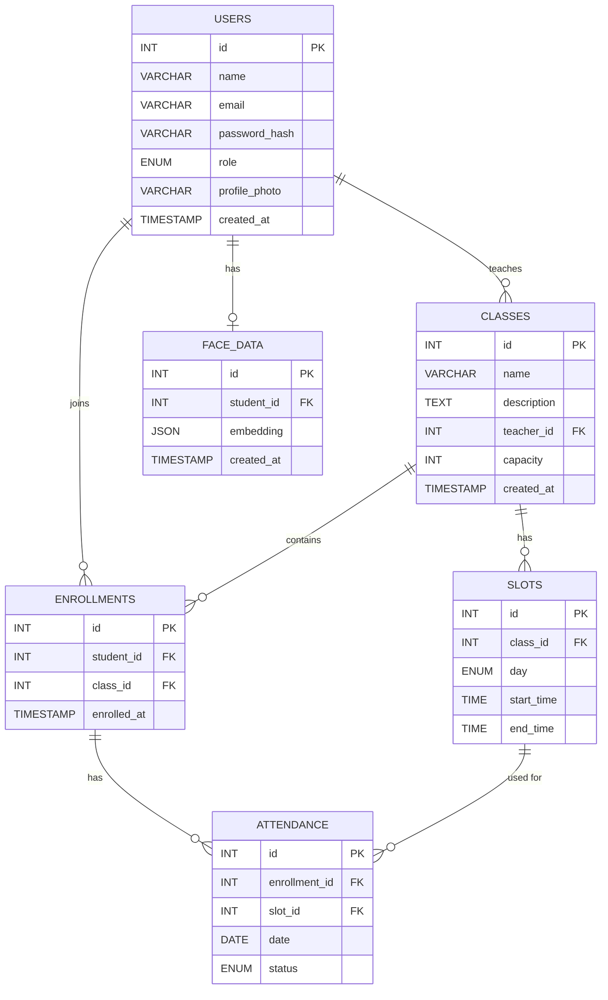

# Database Schema — Student Attendance System

## 1. Project Overview

This project is a small-scale student attendance management system with:

- Student and teacher dashboards
- Classes with multiple weekly time slots
- Pre-seeded students and teachers for initial testing
- Student enrollment into classes
- Face-recognition attendance using **face embeddings**
- Attendance history by date
- No attendance photo/video storage

The schema is intentionally kept simple for a capstone project rather than designed as a large-scale production system.

---

## 2. Final Database Tables

We use **6 tables**:

1. `users` — stores both students and teachers
2. `classes` — stores courses/classes
3. `slots` — stores weekly timings for each class
4. `enrollments` — stores which students belong to which classes
5. `attendance` — stores attendance history
6. `face_data` — stores a student's face embedding

---

## 3. Entity Relationship Diagram



> **Note:** `USERS` contains both students and teachers. The `role` field determines whether a user is a student or teacher.

---

## 4. High-Level Relationship Graph

```text
                         ┌─────────────┐
                         │    USERS    │
                         └──────┬──────┘
                                │
                 ┌──────────────┴──────────────┐
                 │                             │
             teacher                       student
                 │                             │
                 ▼                             ├──────────────┐
          ┌─────────────┐                      │              │
          │   CLASSES   │                      ▼              ▼
          └──────┬──────┘               ┌─────────────┐ ┌─────────────┐
                 │                      │ ENROLLMENTS │ │  FACE_DATA  │
                 ▼                      └──────┬──────┘ └─────────────┘
          ┌─────────────┐                      │
          │    SLOTS    │                      ▼
          └──────┬──────┘               ┌─────────────┐
                 │                      │ ATTENDANCE  │
                 └─────────────────────►└─────────────┘
```

---

# 5. Table Details

## 5.1 `users`

### Purpose

Stores every person who uses the system.

A user can have one of two roles:

- `student`
- `teacher`

### Columns

| Column | Type | Key | Purpose |
|---|---|---|---|
| `id` | INT | PK | Unique user ID |
| `name` | VARCHAR | | User's name |
| `email` | VARCHAR | Optional/Unique later | Login/contact email |
| `password_hash` | VARCHAR | | Hashed password; not required during initial seeded testing |
| `role` | ENUM | | `student` or `teacher` |
| `profile_photo` | VARCHAR | Optional | Photo used for profile/dashboard display |
| `created_at` | TIMESTAMP | | Account creation time |

### Example

```text
1 | Rahul      | NULL | NULL | student | rahul.jpg
2 | Amit       | NULL | NULL | student | amit.jpg
3 | Sharma     | NULL | NULL | teacher | NULL
```

For the initial project testing, users can be inserted manually. Authentication can be added later.

---

# 6. `classes`

## Purpose

Represents the actual course/class.

A class belongs to one teacher.

### Columns

| Column | Type | Key | Purpose |
|---|---|---|---|
| `id` | INT | PK | Unique class ID |
| `name` | VARCHAR | | Class name |
| `description` | TEXT | Optional | Class description |
| `teacher_id` | INT | FK → `users.id` | Teacher responsible for class |
| `capacity` | INT | | Maximum number of students |
| `created_at` | TIMESTAMP | | Creation time |

### Example

```text
10 | Data Structures | DSA course | 3 | 50
11 | DBMS            | Database   | 3 | 40
```

---

# 7. `slots`

## Purpose

A class can happen multiple times during a week.

For example:

```text
DSA
 ├── Monday    10:00–11:00
 ├── Wednesday 14:00–15:00
 └── Friday    11:00–12:00
```

Each timing is stored as a separate slot.

### Columns

| Column | Type | Key | Purpose |
|---|---|---|---|
| `id` | INT | PK | Unique slot ID |
| `class_id` | INT | FK → `classes.id` | Class for this slot |
| `day` | ENUM/VARCHAR | | Day of week |
| `start_time` | TIME | | Starting time |
| `end_time` | TIME | | Ending time |

### Example

```text
101 | 10 | Monday    | 10:00 | 11:00
102 | 10 | Wednesday | 14:00 | 15:00
103 | 10 | Friday    | 11:00 | 12:00
```

Therefore:

```text
Class 10 = DSA

Slot 101 → Monday 10–11
Slot 102 → Wednesday 2–3
Slot 103 → Friday 11–12
```

---

# 8. `enrollments`

## Purpose

Stores which students belong to which classes.

For the first version, enrollment data can be manually seeded.

Later, the student dashboard can create these records when a student chooses a class.

### Columns

| Column | Type | Key | Purpose |
|---|---|---|---|
| `id` | INT | PK | Unique enrollment ID |
| `student_id` | INT | FK → `users.id` | Student |
| `class_id` | INT | FK → `classes.id` | Class |
| `enrolled_at` | TIMESTAMP | | Enrollment time |

### Example

```text
1 | 101 | 10
2 | 102 | 10
3 | 103 | 10
4 | 101 | 11
```

This means:

```text
DSA
 ├── Student 101
 ├── Student 102
 └── Student 103

DBMS
 └── Student 101
```

### Important constraint

A student should not be enrolled in the same class twice:

```sql
UNIQUE(student_id, class_id)
```

---

# 9. `attendance`

## Purpose

Stores the attendance history.

One row represents:

> One student's attendance for one class slot on one particular date.

### Columns

| Column | Type | Key | Purpose |
|---|---|---|---|
| `id` | INT | PK | Unique attendance record |
| `enrollment_id` | INT | FK → `enrollments.id` | Student's enrollment |
| `slot_id` | INT | FK → `slots.id` | Scheduled class slot |
| `date` | DATE | | Actual class date |
| `status` | ENUM | | `present` or `absent` |

### Example

```text
1 | 1 | 101 | 2026-09-07 | present
2 | 2 | 101 | 2026-09-07 | absent
3 | 3 | 101 | 2026-09-07 | present

4 | 1 | 102 | 2026-09-09 | present
5 | 2 | 102 | 2026-09-09 | present
6 | 3 | 102 | 2026-09-09 | absent
```

---

## Attendance Display

The database stores attendance vertically:

```text
Student | Slot | Date       | Status
--------|------|------------|--------
Rahul   | 101  | Sep 7      | Present
Amit    | 101  | Sep 7      | Absent
Priya   | 101  | Sep 7      | Present
Rahul   | 102  | Sep 9      | Present
Amit    | 102  | Sep 9      | Present
Priya   | 102  | Sep 9      | Absent
```

The frontend can transform this into the teacher's preferred view:

| Student | Sep 7 | Sep 9 | Sep 11 |
|---|---|---|---|
| Rahul | P | P | A |
| Amit | A | P | P |
| Priya | P | A | P |

**Dates are therefore displayed as columns in the UI, but are not stored as database columns.**

### Important constraint

Prevent duplicate attendance for the same enrollment, slot, and date:

```sql
UNIQUE(enrollment_id, slot_id, date)
```

---

# 10. `face_data`

## Purpose

Stores the face representation used for attendance verification.

We use a **face embedding**, not repeated attendance photos.

### Registration/setup flow

```text
Student photo
      │
      ▼
Face detection
      │
      ▼
Face recognition model
      │
      ▼
Face embedding
      │
      ▼
Store embedding
```

### Attendance flow

```text
Camera
   │
   ▼
Live face
   │
   ▼
Generate embedding
   │
   ▼
Compare with stored embedding
   │
   ▼
Identify student
   │
   ▼
Create attendance record
```

### Columns

| Column | Type | Key | Purpose |
|---|---|---|---|
| `id` | INT | PK | Unique face-data ID |
| `student_id` | INT | FK → `users.id` | Student whose face is stored |
| `embedding` | JSON | | Face embedding vector |
| `created_at` | TIMESTAMP | | Time embedding was created |

### Important constraint

For the first version, keep one registered embedding per student:

```sql
UNIQUE(student_id)
```

The profile photo may be kept in `users.profile_photo` for dashboard display, but it is **not required for face verification**.

We do not store photos from each attendance attempt.

---

# 11. Complete Data Flow

## Student setup

```text
                 USER
                  │
                  ▼
              Student
                  │
          ┌───────┴────────┐
          ▼                ▼
    FACE_DATA          ENROLLMENT
          │                │
    embedding             │
                           ▼
                         CLASS
                           │
                           ▼
                          SLOT
```

## Attendance

```text
Camera
  │
  ▼
Face
  │
  ▼
Embedding
  │
  ▼
Match student
  │
  ▼
Find enrollment
  │
  ▼
Identify current slot
  │
  ▼
Create attendance
```

---

# 12. Example Complete Dataset

Suppose we have:

### Users

```text
1 | Rahul      | student
2 | Amit       | student
3 | Priya      | student
10 | Mr. Sharma | teacher
```

### Classes

```text
100 | DSA  | teacher_id = 10 | capacity = 50
101 | DBMS | teacher_id = 10 | capacity = 40
```

### Slots

```text
1 | class 100 | Monday    | 10:00–11:00
2 | class 100 | Wednesday | 14:00–15:00
3 | class 100 | Friday    | 11:00–12:00

4 | class 101 | Tuesday   | 10:00–11:00
5 | class 101 | Thursday  | 14:00–15:00
```

### Enrollments

```text
1 | Rahul | DSA
2 | Amit  | DSA
3 | Priya | DSA
4 | Rahul | DBMS
```

### Face data

```text
Rahul → embedding
Amit  → embedding
Priya → embedding
```

### Attendance

```text
Rahul | DSA | Sep 7  | Present
Amit  | DSA | Sep 7  | Absent
Priya | DSA | Sep 7  | Present

Rahul | DSA | Sep 9  | Present
Amit  | DSA | Sep 9  | Present
Priya | DSA | Sep 9  | Absent
```

---

# 13. Design Decisions We Have Finalized

| Decision | Final choice |
|---|---|
| Students and teachers | Same `users` table |
| User role | `role` column |
| Initial users | Manually seeded |
| Authentication | Not required for initial testing |
| Courses/classes | `classes` table |
| Multiple class timings | `slots` table |
| Student-class relationship | `enrollments` table |
| Attendance history | `attendance` table |
| Face recognition | Face embeddings |
| Face embedding storage | `face_data` |
| Attendance photos | Not stored |
| Profile photo | Optional, for display |
| Session ID | Not required |
| Separate student table | Not required |
| Separate teacher table | Not required |
| `class_slots` junction table | Not required |
| Vector database | Not required |
| Scale | Small capstone project |

---

# 14. Core Schema in One View

```text
USERS
 ├── id
 ├── name
 ├── email
 ├── password_hash
 ├── role
 └── profile_photo
       │
       ├───────────────┐
       │               │
       ▼               ▼
   CLASSES         FACE_DATA
       │               │
       │               └── student_id
       ▼
     SLOTS

USERS (student)
       │
       ▼
 ENROLLMENTS
       │
       ├── student_id
       └── class_id
              │
              ▼
           CLASSES

ENROLLMENTS
       │
       ▼
 ATTENDANCE
       │
       ├── enrollment_id
       ├── slot_id
       ├── date
       └── status
```

---

## 15. Future Extensions

The current schema is intentionally simple. If the project grows, we can later add:

- Student self-registration
- Authentication/JWT
- Password reset
- Admin role
- Multiple face embeddings per student
- Attendance timestamps
- Late/early status
- Attendance reports
- Semester/batch information
- Notifications
- Audit logs

These are **not required for the first version**.
